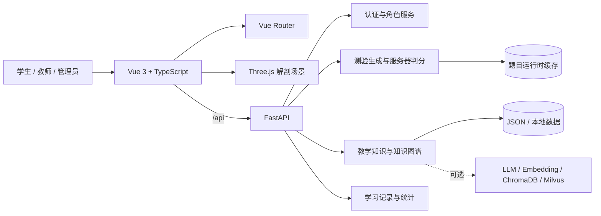
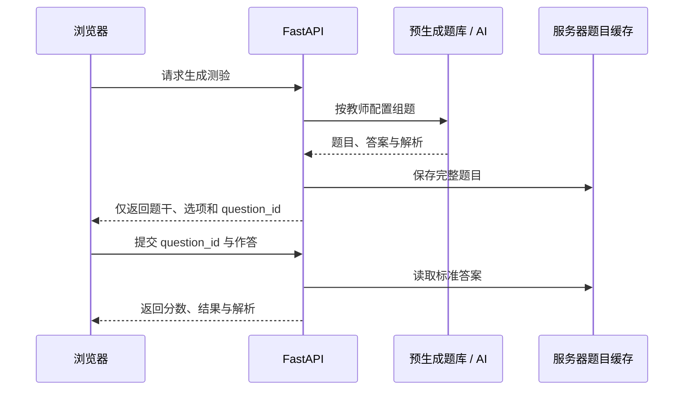

# 临思智训：AI 医学解剖与教学知识平台

> 面向医学教育的三维解剖学习、AI 测验与教学知识管理演示系统。

本项目围绕医学教学中的“观察、识别、练习、反馈、管理”构建完整演示流程：学生可在浏览器中操作高精度人体三维模型、按系统学习解剖结构并完成 AI 测验；教师可配置考试参数、维护教学资料；管理员可查看平台数据并管理知识内容。系统同时提供医学知识图谱和学习档案，便于展示知识关联与训练记录。

> **医学声明**：本系统仅用于教学、竞赛演示与技术研究，不提供医疗诊断、治疗建议或临床决策支持，也不应替代专业医务人员的判断。

## 当前版本

- 开发分支：`2026-9-17-12th`
- 前端重点：三维解剖训练、AI 测验、学习档案、教师考试配置、教学知识库、知识图谱
- 后端形态：FastAPI 单体 API + SQLite 认证，保留部分早期临床训练与数字人实验接口
- 运行方式：本地前后端分离开发，前端默认代理到 `http://127.0.0.1:8000`

## 核心能力

### 三维解剖学习

- 基于 Three.js 渲染可旋转、缩放和点选的人体解剖模型。
- 支持按器官系统筛选、结构搜索、透明度调整、显示/隐藏和结构聚焦。
- 当前模型包含 `1,742` 个部件、`11` 个分块、`1,416,914` 个三角面和 `48` 个器官分组。
- 覆盖运动、循环、呼吸、消化、泌尿、生殖、神经、内分泌、淋巴 `9` 个教学系统。
- 解剖术语表包含 `1,202` 条术语，覆盖模型中 `1,199` 个唯一结构名称。

### AI 测验与判分

- 支持预生成题库和实时 AI 出题两种模式。
- 教师可配置题量、难度、题型、系统范围和出题模式。
- 题目下发时不会携带正确答案和解析。
- 学生提交 `question_id` 与作答内容，由后端依据服务器缓存完成判分。
- 运行时题目缓存位于 `data/exam_questions.json`，该文件不纳入 Git，最多保留 `250` 份测验。

### 教学知识与知识图谱

- 支持教学资料的新增、编辑、删除、上传、处理和向量化任务。
- 内置 `85` 条教学知识数据。
- 兼容保留的临床综合图谱包含 `662` 个节点和 `1,612` 条边，可供后续扩展临床检索。
- 面向当前解剖主线的图谱包含 `736` 个节点和 `1,011` 条关系，按人体解剖、系统、器官、精细结构四层组织；原临床综合图谱作为兼容数据保留。
- 后端保留 ChromaDB、Milvus 和混合 RAG 的配置入口，便于扩展检索增强问答。

### 账号与邮箱认证

- 支持学生和教师通过邮箱注册，验证链接 30 分钟有效且仅可使用一次。
- 学生验证邮箱后可直接登录；教师还需管理员审核。
- 支持忘记密码、15 分钟一次性重置链接和重发验证邮件。
- 密码使用 PBKDF2-SHA256 加盐哈希，登录使用服务端随机会话；重置密码会吊销旧会话。
- 用户、令牌和会话保存在本地 SQLite，默认文件为 `data/auth.sqlite3`，不会提交到 Git。

### 管理员控制的 Skill 与解剖 Agent

- `/admin/skills` 管理三个预置只读能力：`anatomy_search`、`textbook_search`、`graph_query`。
- 所有 Skill 默认关闭；管理员决定启停、允许角色和每账号每小时额度，配置即时影响后续调用。
- 解剖导师按输入规划最多三次工具调用，展示实际教材片段、引用、图谱归属关系和调用状态，支持联动模型定位。
- Agent 身份来自服务端会话，不相信请求中的 `role`；管理员测试也遵守相同权限与额度。
- 配置与调用记录保存在 `data/skills.sqlite3`，可通过 `SKILL_DATABASE_PATH` 配置位置，不纳入 Git。
- 当前为本地有界工具编排，不是大模型自主推理；不支持任意脚本、远程插件安装或 AI 修改知识库。

接口与验收说明见 [`docs/SKILL_AGENT_SETUP.md`](docs/SKILL_AGENT_SETUP.md)。

### 三类角色

| 角色 | 当前主要功能 |
| --- | --- |
| 学生 | 学习概览、三维解剖训练、AI 测验、学习档案与复习记录 |
| 教师 | 教学看板、教学知识维护、考试参数配置 |
| 管理员 | 平台概览、教学知识管理、数据处理状态查看 |

## 系统架构



## 技术栈

| 层级 | 技术 |
| --- | --- |
| 前端 | Vue 3、TypeScript、Vite、Vue Router、Three.js、Lucide Icons |
| 后端 | Python、FastAPI、Uvicorn、Pydantic、python-dotenv |
| AI / RAG | OpenAI 兼容接口、LangChain、ChromaDB、Milvus（可选） |
| 数据 | SQLite、JSON、本地静态资源、浏览器本地状态 |
| 工程化 | pnpm、vue-tsc、pytest |

## 项目结构

```text
medical_system/
├─ backend/
│  ├─ app/
│  │  ├─ api/                 # 扩展 API 路由
│  │  ├─ services/            # 认证、邮件、测验等领域服务
│  │  ├─ config.py            # 环境变量与服务配置
│  │  └─ main.py              # FastAPI 入口与核心 API
│  ├─ scripts/                # 数据构建与校验脚本
│  ├─ tests/                  # 后端测试
│  └─ requirements.txt
├─ data/                      # 教学知识、图谱和运行数据
├─ env/                       # 本地环境变量文件
├─ frontend/
│  ├─ public/anatomy/         # 分块三维模型与署名信息
│  └─ src/
│     ├─ assets/              # 医学图片与样式资源
│     ├─ components/          # 通用与业务组件
│     ├─ layouts/             # 产品壳层
│     ├─ router/              # 路由与角色守卫
│     ├─ services/            # API 与前端服务
│     ├─ stores/              # 认证和训练状态
│     └─ views/               # 学生、教师、管理员页面
├─ scripts/                   # 项目级辅助脚本
├─ services/                  # 可选数字人等实验服务
├─ storage/                   # 向量库等本地存储
├─ DESIGN.md
├─ PRODUCT.md
└─ pnpm-lock.yaml
```

## 快速开始

### 1. 环境要求

- Windows 10/11 或兼容开发环境
- Conda，并已创建 `pytorch_env`
- Node.js 20+ 与 Corepack/pnpm
- 支持 WebGL 的现代浏览器

### 2. 启动后端

在项目根目录执行：

```powershell
conda activate pytorch_env
pip install -r backend/requirements.txt
python -m backend.app.main
```

后端默认地址：`http://127.0.0.1:8000`

健康检查：`http://127.0.0.1:8000/api/health`

### 3. 启动前端

另开一个终端，在项目根目录执行：

```powershell
corepack enable
pnpm --dir frontend install
pnpm --dir frontend dev
```

浏览器访问：`http://127.0.0.1:5173`

如后端不在默认地址，可在启动前设置：

```powershell
$env:VITE_API_TARGET = "http://127.0.0.1:8000"
pnpm --dir frontend dev
```

## 可选 AI 配置

后端启动时读取 `env/.env`。不配置外部服务时，仍可使用项目内置数据和预生成演示能力；实时 AI、Embedding 或外部向量库功能需要填写相应配置。

先从无密钥模板创建本地配置：

```powershell
New-Item -ItemType Directory -Force env
Copy-Item .env.example env/.env
```

```dotenv
OPENAI_API_KEY=
OPENAI_BASE_URL=https://api.openai.com
OPENAI_MODEL=gpt-4.1

EMBEDDING_API_KEY=
EMBEDDING_BASE_URL=https://dashscope.aliyuncs.com/compatible-mode
EMBEDDING_MODEL=text-embedding-v3

RAG_PROVIDER=local
CHROMA_DB_PATH=./storage/chroma
MILVUS_HOST=127.0.0.1
MILVUS_PORT=19530
```

不要提交真实密钥。部署环境应通过环境变量或密钥管理服务注入敏感配置。

## 邮箱认证配置

注册验证和密码找回需要 SMTP SSL 服务。在 `env/.env` 中填写邮箱服务商提供的 SMTP 地址、邮箱账号和独立授权码：

```dotenv
MAIL_HOST=smtp.163.com
MAIL_PORT=465
MAIL_USERNAME=
MAIL_PASSWORD=
MAIL_FROM_NAME=临思智训
PUBLIC_FRONTEND_URL=http://127.0.0.1:5173
AUTH_DATABASE_PATH=./data/auth.sqlite3
```

未配置 SMTP 时，演示账号仍可登录，但新账号无法收到验证或重置邮件。完整说明见 [`docs/EMAIL_AUTH_SETUP.md`](docs/EMAIL_AUTH_SETUP.md)。

## 演示账号

| 角色 | 用户名 | 密码 |
| --- | --- | --- |
| 学生 | `student` 或 `student01` | `student123` |
| 教师 | `teacher` 或 `teacher01` | `teacher123` |
| 管理员 | `admin` | `admin123` |

演示账号同样通过真实服务端会话登录。`student` 和 `teacher` 是兼容别名；项目不再通过 URL 查询参数绕过登录。

## 前端路由

| 路由 | 访问角色 | 用途 |
| --- | --- | --- |
| `/landing` | 公开 | 产品入口 |
| `/login` | 公开 | 登录与角色选择 |
| `/register` | 公开 | 学生/教师邮箱注册 |
| `/verify-email` | 公开 | 邮箱验证回调 |
| `/resend-verification` | 公开 | 重发验证邮件 |
| `/forgot-password` | 公开 | 申请密码重置邮件 |
| `/reset-password` | 公开 | 设置新密码 |
| `/onboarding` | 已登录 | 首次使用信息设置 |
| `/student/dashboard` | 学生 | 学习概览 |
| `/student/anatomy` | 学生 | 三维解剖训练与测验 |
| `/student/archive` | 学生 | 学习档案、历史与复习 |
| `/student/history` | 学生 | 重定向到学习档案历史标签 |
| `/student/daily-review` | 学生 | 重定向到学习档案复习标签 |
| `/teacher/dashboard` | 教师 | 教学看板 |
| `/teacher/knowledge` | 教师 | 教学知识管理 |
| `/teacher/exam-settings` | 教师 | 测验参数配置 |
| `/admin/dashboard` | 管理员 | 管理概览 |
| `/admin/skills` | 管理员 | Skill 启停、权限、额度、测试与调用记录 |
| `/admin/knowledge` | 管理员 | 教学知识管理 |
| `/knowledge-graph` | 已登录 | 医学知识图谱 |
| `/help` | 已登录 | 帮助中心 |

## 核心 API

| 方法 | 路径 | 用途 |
| --- | --- | --- |
| `GET` | `/api/health` | 服务健康检查 |
| `POST` | `/api/auth/login` | 登录 |
| `POST` | `/api/auth/register` | 注册学生或教师账号 |
| `POST` | `/api/auth/verify-email` | 验证邮箱 |
| `POST` | `/api/auth/resend-verification` | 重发验证邮件 |
| `POST` | `/api/auth/forgot-password` | 申请密码重置 |
| `POST` | `/api/auth/reset-password` | 使用一次性令牌重置密码 |
| `GET` | `/api/auth/me` | 获取当前用户 |
| `GET` | `/api/admin/skills` | 获取预置 Skill 与生效配置 |
| `PUT` | `/api/admin/skills/{skill_id}` | 管理员更新 Skill 配置 |
| `POST` | `/api/admin/skills/{skill_id}/test` | 在当前管理员权限和额度内测试 |
| `GET` | `/api/admin/skills/calls` | 获取最近调用记录 |
| `POST` | `/api/agent/chat` | 已登录用户的导航或解剖工具编排 |
| `POST` | `/api/auth/logout` | 注销当前服务端会话 |
| `PUT` | `/api/admin/users/{user_id}/teacher-review` | 管理员审核教师账号 |
| `GET` | `/api/anatomy` | 获取解剖教学数据 |
| `GET` | `/api/anatomy/glossary` | 获取解剖术语表 |
| `POST` | `/api/anatomy/submit` | 提交解剖训练结果 |
| `GET` | `/api/exam/settings` | 获取考试配置 |
| `PUT` | `/api/exam/settings` | 更新考试配置 |
| `POST` | `/api/exam/quiz/generate` | 生成测验 |
| `POST` | `/api/exam/quiz/grade` | 服务器端判分 |
| `GET` | `/api/exam/quiz/status` | 查询测验服务状态 |
| `GET` | `/api/teacher/teaching-knowledge` | 获取教学知识 |
| `POST` | `/api/admin/teaching-knowledge/upload` | 上传教学资料 |
| `GET` | `/api/knowledge-graph` | 获取知识图谱 |
| `GET` | `/api/graph/search` | 搜索图谱节点 |

完整接口以 `backend/app/main.py` 和 FastAPI 自动文档为准：启动后访问 `http://127.0.0.1:8000/docs`。需要配置外部服务时，按 [`docs/API_INTEGRATION_CHECKLIST.md`](docs/API_INTEGRATION_CHECKLIST.md) 逐项检查。

## 测验安全流程



这种设计避免在答题前把标准答案直接暴露给浏览器。当前缓存用于单机演示；多实例或正式部署应替换为 Redis、数据库等共享持久化存储，并增加会话绑定、过期时间和访问审计。

## 测试与构建

所有 Python 命令均在 `pytorch_env` 中执行。

```powershell
conda activate pytorch_env
python -m pytest backend/tests
python -m compileall backend
```

```powershell
pnpm --dir frontend exec vue-tsc --noEmit
pnpm --dir frontend build
```

当前分支最近一次验证结果：

- 后端测试：`32` 项通过
- Vue TypeScript 检查：通过
- Vite 生产构建：通过
- Python 编译检查：通过
- 真实 AI 出题与服务器端判分链路：通过

## 数据与许可

- 三维人体模型基于 BodyParts3D 4.0，采用 CC BY 4.0；模型打包方式参考 MIT 许可的 `ashemag/human-atlas`。详见 [`frontend/public/anatomy/ATTRIBUTION.md`](frontend/public/anatomy/ATTRIBUTION.md)。
- 医学解剖图片来源包括 Wikimedia Commons、OpenStax 与 Blausen 等，具体许可包含 Creative Commons 与公有领域内容。详见 [`frontend/src/assets/medical/anatomy/ATTRIBUTION.md`](frontend/src/assets/medical/anatomy/ATTRIBUTION.md)。
- 使用、分发或展示项目前，请同时遵守仓库根目录 [`LICENSE`](LICENSE) 和各资源署名文件中的要求。

## 已知限制

- 当前认证已使用密码哈希、一次性令牌和服务端会话，但 SQLite 单机存储与进程内限流仍以竞赛演示为目标，不等同于生产级身份平台。
- 实时 AI 出题依赖可用的 OpenAI 兼容服务、网络与正确的模型配置。
- 大型三维模型首次加载受设备 GPU、浏览器和磁盘读取速度影响。
- 测验缓存当前为单机 JSON 文件，不适用于并发多实例部署。
- 后端仍保留早期临床训练、RAG、语音与数字人实验代码；当前前端主流程聚焦解剖教学与教学知识管理。

## 后续方向

- 将认证、训练记录、题库和教学资料迁移到正式数据库或学校统一身份平台。
- 为测验缓存增加用户绑定、过期策略、幂等控制和共享存储。
- 扩充医学课程数据，并建立可审核、可追溯的数据治理流程。
- 增加端到端测试、视觉回归测试和性能基准。
- 完善生产部署、权限模型、日志审计与监控告警。

---

本仓库用于第八届全球校园人工智能算法精英大赛 AI 医学方向的作品开发与演示。
