# 临思智训：AI 标准化病人临床思维训练平台

本项目是面向医学教育的 AI 标准化病人临床思维训练平台原型，不用于真实临床诊断。平台通过 AI 标准化病人、临床思维评分、教材学习路径、可追溯指南知识库、教师看板、超级管理员控制台、Agent Workflow、Hybrid RAG、双语医学知识图谱和解剖定位训练，帮助医学生训练问诊、鉴别诊断、检查选择、治疗原则和循证依据查找能力。

第五版重点把你提供的医学教材体系并入平台：基础医学 -> 桥梁课程 -> 临床核心 -> 专科拓展 -> 实践能力，同时加入英文经典参考书、ModelScope 数据源规划、管理员账号体系、双语图谱和 Obsidian 风格导出。所有病例均为虚拟教学病例，不包含真实患者信息，不写入真实 API 密钥。

## 第七版：WSL2 本地真实数字人

本机已配置独立的 WSL2 GPU 推理环境，数字人从原来的 CSS 状态模拟升级为 **Edge TTS 中文语音 + MuseTalk 1.5 CUDA 嘴型同步视频**。前端仍使用统一的 `/api/digital-human/speak`，主后端负责模式选择与失败回退，8090 独立服务负责重型推理。

- 真实实现：中文文本转语音、RTX 4060 CUDA 推理、H.264/AAC 视频生成、静态视频服务、前端播放器、状态联动和 Mock 降级。
- 当前限制：离线生成约需 30–60 秒；主要驱动嘴型，不等同于实时全身动作数字人。
- 启动：在主后端和前端之前运行 `.\start-digital-human.ps1`。
- 健康检查：`http://127.0.0.1:8090/health`。
- 详细说明：`services/liveact_service/README.md`。
## 第六版：医学训练闭环与路由化产品

本版将原先集中在单个 `App.vue` 的工作台拆分为 Vue Router 产品结构，形成“身份分流 -> 学生/教师工作台 -> 病例配置 -> 标准化病人问诊 -> 七维临床思维报告 -> 历史记录/教师复核”的完整演示闭环。

### 主要路由

- `/landing`：医学教育身份入口与智能体指令入口。
- `/onboarding`：学生年级/专业/训练方向或教师课程/班级信息配置。
- `/student/dashboard`：训练次数、能力趋势、薄弱项和推荐病例。
- `/student/cases`：按科室、症状和难度筛选虚拟教学病例。
- `/student/case/new`：选择病例、难度和训练模式。
- `/patient-room/:caseId`：全屏标准化病人问诊与临床思维草稿。
- `/training-report/:sessionId`：七维评分、诊断路径、错因、风险、证据与教师复核。
- `/student/history`：历史训练记录和能力档案。
- `/teacher/dashboard`：班级趋势、薄弱项、干预名单和教学建议。
- `/teacher/cases`：病例脚本、评分点、高风险项和指南证据管理。
- `/teacher/reports`：报告复核与班级聚合分析。
- `/knowledge-graph`：医学知识网络和可追溯依据检索。

### 实现边界

已真实实现：Vue Router 路由、学生/教师分区、8 个独立病例数据切换、问诊状态管理、后端脚本化患者回答、检查资料解锁、临床思维草稿、训练提交、报告生成、历史记录、Agent 结构化导航和移动端布局。

演示/Mock：演示身份登录、评分公式、教师班级名单、部分报告数据、后端不可用时的本地病例回答、付费大模型和真实向量数据库调用。数字人已接入本机 WSL2 的 MuseTalk 1.5 + Edge TTS 真实 GPU 嘴型视频；推理失败时仍保留 Mock 回退。

### 演示直达

- 学生工作台：`http://127.0.0.1:5173/student/dashboard?demo=student`
- 胸痛问诊室：`http://127.0.0.1:5173/patient-room/emergency_chest_pain?demo=student`
- 教师报告复核：`http://127.0.0.1:5173/teacher/reports?demo=teacher`
## 演示登录

- 学生端：`student / student123`
- 教师端：`teacher / teacher123`
- 超级管理员：`admin / admin123`

前端使用 localStorage 保存演示登录状态；后端提供 mock auth 接口：

- `POST /api/auth/login`
- `GET /api/auth/me`
- `POST /api/auth/logout`

## 技术栈

- 前端：Vue 3、TypeScript、Vite、HTML、CSS、JavaScript
- 后端：Python、FastAPI、Flask、Pydantic
- AI 骨架：PatientAgent、TutorAgent、ScoringAgent、RetrievalAgent、SafetyAgent、ReportAgent
- RAG：HybridRetrievalService、mock embedding、citation 返回、Milvus/ChromaDB 占位
- 知识图谱：双语 JSON mock，Neo4j 占位，Obsidian Markdown 导出预览
- 配置：`.env.example` 占位，不包含真实密钥

## 第五版新增内容

- 新增登录页和三类角色：学生、教师、超级管理员。
- 新增超级管理员工作台：用户管理、ModelScope 数据源、知识库状态、图谱状态、RAG 配置、Obsidian 导出。
- ModelScope 数据源规划包含 `AI-ModelScope/med_qa`、`GoodBaiBai88/M3D-VQA`、`GoodBaiBai88/M3D-Cap`、`GoodBaiBai88/M3D-Seg`。
- 知识库扩展为 85 条双语 mock 知识，保留 title_zh/title_en、summary_zh/summary_en、citation、embedding_text、graph_node_ids。
- 双语医学教育知识图谱扩展为 177 个节点、162 条关系，节点包含疾病、症状、体征、检查、诊断、鉴别诊断、治疗原则、指南依据、学习目标和教材节点。
- 知识图谱支持中文/英文切换、ACS/chest pain 等英文术语检索、节点详情、邻居关系和学习路径。
- RAG 返回 `matched_knowledge`、`graph_nodes`、`graph_edges`、`bilingual_terms`、相关病例、相关解剖练习和推荐学习路径。
- 教材学习路径纳入基础医学、桥梁课程、临床核心、专科拓展、实践能力、英文经典参考。

## 项目目录结构

```text
ai+medicine/
  frontend/
    src/
      App.vue                  三角色产品工作台
      api.ts                   前端 API 封装
      types.ts                 前端类型定义
      styles.css               响应式 UI、登录页、管理员台、数字人、解剖图、图谱样式
      data/
        admin.ts               管理员用户和数据源 mock
        cases.ts               8 个虚拟教学病例
        knowledge.ts           85 条双语知识条目
        graph.ts               177 节点 / 162 关系双语图谱
        textbooks.ts           教材学习路径
        anatomy.ts             解剖定位练习
  backend/
    app/
      main.py                  FastAPI 路由、Auth、Agent、训练、RAG、图谱、管理端
      models.py                Pydantic 模型
      data_sources.py          管理端数据源加载
      translation_service.py   双语术语服务
      obsidian_export_service.py Obsidian Markdown 预览导出
      embedding_service.py     mock embedding 服务
      hybrid_retrieval_service.py
      knowledge_graph_service.py
      flask_app.py             Flask 辅助模块
  data/
    admin_users.json
    data_sources.json
    textbook_pathways.json
    knowledge.json
    medical_kg_bilingual.json
    cases.json
    anatomy.json
    guidelines.json
  .env.example
```

## 系统总体架构图

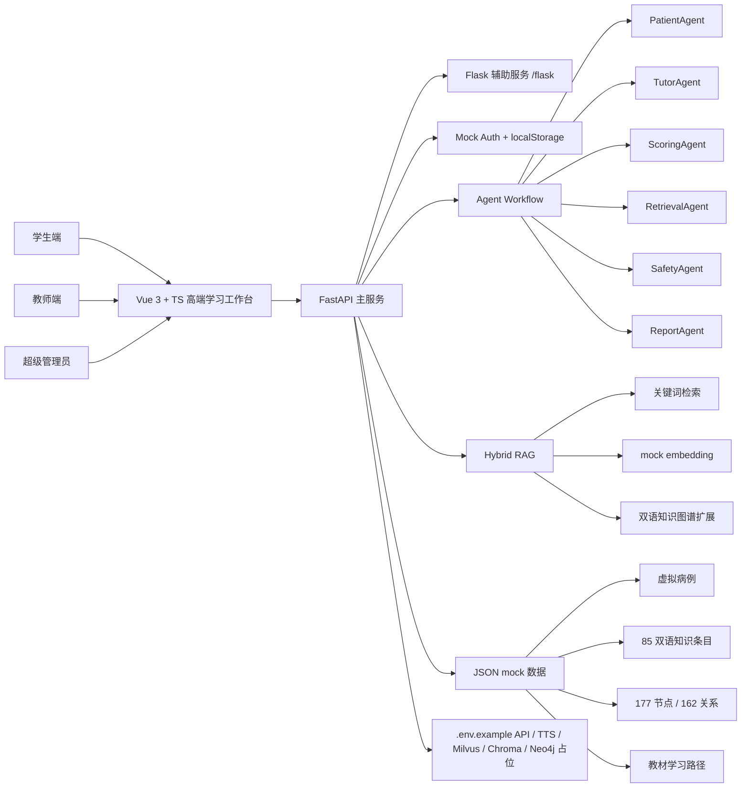

## Agent + Workflow 流程图

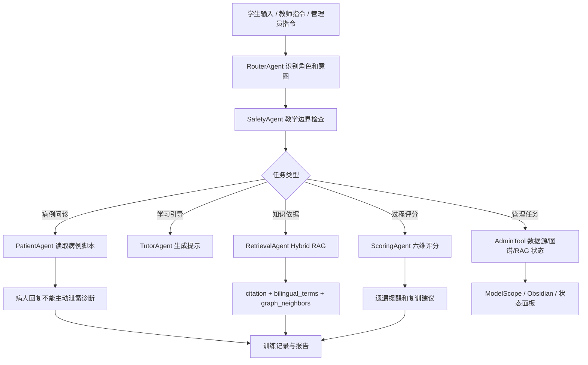

## RAG 检索流程图

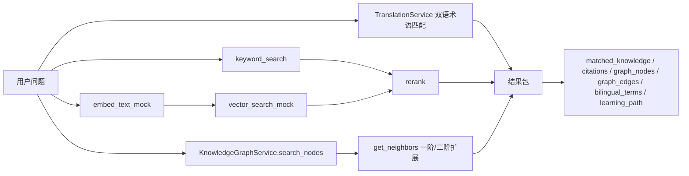

后续接入真实服务时：`EmbeddingService` 替换为真实 embedding API，mock vector 替换为 ChromaDB 或 Milvus，`KnowledgeGraphService` 替换为 Neo4j 查询，`RetrievalAgent` 可接 LangChain Runnable 或 LangGraph。

## 医学知识图谱示意图

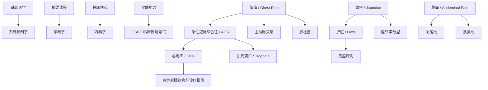

## ModelScope 数据源接入流程图

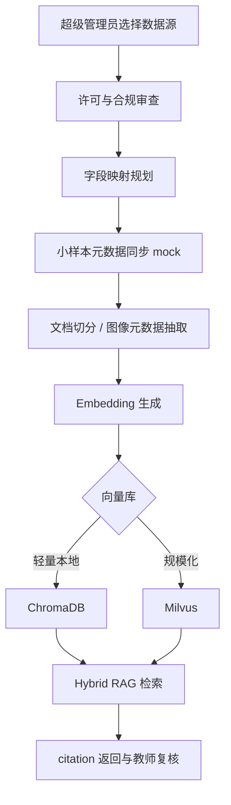

## Obsidian 图谱导出流程图

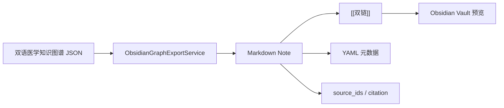

## 主要后端接口

- `POST /api/auth/login`
- `GET /api/auth/me`
- `POST /api/auth/logout`
- `GET /api/cases`
- `POST /api/training/chat`
- `GET /api/training/report`
- `GET /api/knowledge/search?q=ACS&lang=en`
- `GET /api/graph?lang=zh`
- `GET /api/graph/search?query=ACS&lang=en`
- `POST /api/rag/query`
- `POST /api/rag/hybrid-query`
- `GET /api/textbook-pathways`
- `GET /api/admin/users`
- `GET /api/admin/data-sources`
- `POST /api/admin/data-sources/sync`
- `GET /api/admin/knowledge-status`
- `GET /api/admin/graph-status`
- `POST /api/admin/obsidian/export`

## `.env.example` 配置说明

根目录 `.env.example` 保留 LLM API、TTS API、Embedding、Milvus、ChromaDB、Neo4j、Backend、Frontend 配置占位。不要写真实密钥。后端默认没有真实配置时使用 mock 能力。

## SoulX-LiveAct 高端可选方案（非本机默认）

数字人已升级为“前端播放器 + 主后端适配器 + 独立推理服务”结构。默认采用 Mock 模式，使用项目内医学导师素材、状态光效、讲话波纹和字幕模拟 `idle`、`listening`、`speaking`、`warning`、`scoring` 五种状态；没有 GPU 或模型权重时页面不会空白。导师素材位于 `frontend/src/assets/digital-human/`，来自本项目用户提供的虚拟导师视觉，不使用真实患者照片。

新增目录与职责：

```text
frontend/src/components/DigitalHumanPanel.vue      模式、字幕、状态和控制区
frontend/src/components/DigitalHumanPlayer.vue     视频/流式结果播放器与 Mock 动画
frontend/src/services/digitalHumanApi.ts            数字人 API 封装
backend/app/services/digital_human_service.py       主后端适配与自动降级
backend/app/api/digital_human.py                    数字人 REST API
services/liveact_service/server.py                  独立 FastAPI 推理服务
services/liveact_service/liveact_adapter.py         SoulX-LiveAct 输入与命令适配
services/liveact_service/mock_liveact.py             无 GPU Mock 结果
```

### 集成架构

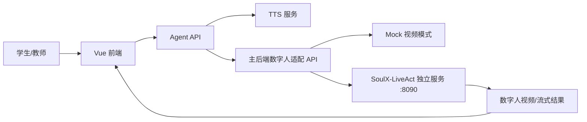

采用独立服务是为了隔离 CUDA、Torch、vLLM、wav2vec2、模型权重和长时间 GPU 任务。主 FastAPI 服务始终轻量运行，LiveAct 服务不可用或超时时会自动返回与真实模式相同的数据结构并降级到 Mock。

### 模式与联动

| 模式 | 用途 | 依赖 |
| --- | --- | --- |
| `mock` | 本地开发、比赛演示、无 GPU 环境 | 无模型；使用项目导师图和高级状态动画 |
| `liveact` | 请求独立 LiveAct 服务生成视频或流 | 独立 Conda/GPU/模型环境；失败自动回退 Mock |

用户输入会触发 `listening`，ScoringAgent 与解剖评分会触发 `scoring`，Agent/RAG 回复会触发 `speaking`；文本包含主动脉夹层、肺栓塞等高风险内容时切换为 `warning`。字幕始终使用 Agent 或 TTS 文本，播放器支持播放、暂停、静音、重新生成和模式切换。

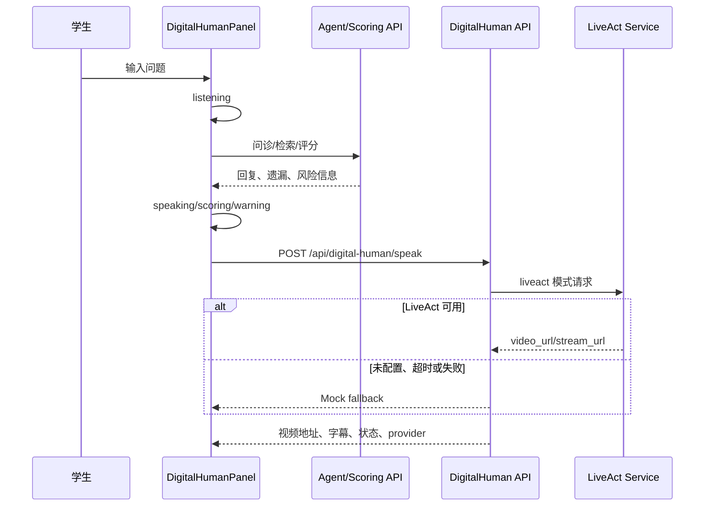

### 数字人 API

- `POST /api/digital-human/session`：建立演示会话。
- `POST /api/digital-human/status`：同步待机、倾听、讲解、风险和评分状态。
- `POST /api/digital-human/speak`：生成讲解；LiveAct 不可用时自动 Mock。
- `GET /api/digital-human/modes`：返回模式、可用状态和当前 provider。
- `GET /api/digital-human/mock-video`：返回五种 Mock 状态元数据。

### 独立服务启动规划

普通电脑只启动主后端和前端即可。要验证独立服务的 Mock 通路，可另开终端：

```powershell
cd D:\cc项目\ai+medicine
.\.venv\Scripts\python.exe -m uvicorn services.liveact_service.server:app --host 127.0.0.1 --port 8090
```

真实模式按 [SoulX-LiveAct 官方仓库](https://github.com/Soul-AILab/SoulX-LiveAct) 单独创建 Python 3.10 Conda 环境，安装官方依赖，下载 checkpoint 与 `chinese-wav2vec2-base`，再设置 `LIVEACT_EXECUTION_MODE=command`、`LIVEACT_REPO_PATH`、`LIVEACT_CKPT_DIR` 和 `LIVEACT_WAV2VEC_DIR`。适配器会生成独立 input JSON，并以无 shell 的参数列表调用推理命令；实际部署时需要依据所检出版本的官方示例确认最终字段映射。

官方说明 H100/H200 适合实时流式推理；RTX 4090/5090 可使用 FP8 KV cache、block offload、T5 CPU 等节省显存方案，但吞吐会下降。模型权重不下载进本项目，生成视频也不提交版本库。

### 配置、许可与后续计划

`.env.example` 已加入 `DIGITAL_HUMAN_MODE`、独立服务地址、仓库/权重/wav2vec 路径、画面尺寸、FPS、设备和显存优化开关，以及 `TTS_PROVIDER`。所有值均为占位或安全默认值，不包含真实密钥。

正式比赛发布或商业部署前，应再次核对 SoulX-LiveAct 代码、模型权重、wav2vec2、导师素材和生成内容的许可证；不得输入真实患者照片或隐私数据。后续可将 Mock TTS 替换为真实语音服务，将轮询视频地址升级为 WebSocket/WebRTC 流，并增加任务队列、GPU 调度、缓存和审计。

### GPU 算子加速层

数字人独立服务现支持 NVIDIA CUTLASS 与 LightX2V kernel 的可选加速探测和安全回退。它们属于底层矩阵运算与量化算子加速，不替代 SoulX-LiveAct 数字人模型。主后端新增 `GET /api/digital-human/acceleration`，独立服务新增 `GET /kernel-health`。Ubuntu/WSL2 部署、构建命令和环境变量见 [`docs/digital-human-gpu-acceleration.md`](docs/digital-human-gpu-acceleration.md)。
## 本地启动步骤

后端：

```powershell
cd D:\cc项目\ai+medicine
.\scripts\start-backend.ps1 -Python .\.venv\Scripts\python.exe
```

接口文档：`http://127.0.0.1:8000/docs`

前端：

```powershell
cd D:\cc项目\ai+medicine\frontend
pnpm dev
```

前端访问：`http://127.0.0.1:5173`

## 后续可扩展方向

- 接入真实 LLM、TTS 和数字人视频流。
- 把教材目录、指南摘要、病例脚本走教师审核后进入 RAG。
- 将 ChromaDB 用作本地演示，将 Milvus 用作竞赛展示规模化检索。
- Neo4j 接管双语知识图谱查询和推荐路径生成。
- 为教师端增加班级、课程、OSCE 站点和批改工作流。
- 为管理员端增加数据源权限、许可审查、脱敏审计和同步任务队列。


## 可持续增长的虚拟教学病例库

当前原型内置 **41 个合成虚拟教学病例**，覆盖急诊、心血管、呼吸、消化、神经、血液、肾脏、内分泌、外科、儿科、妇产科、老年医学与全科医学。原有 8 个病例 ID 保持兼容，并新增常见症状和常见疾病病例。`scripts/generate_case_library.py` 是病例数据的可重复生成入口，一次生成：

- `data/cases.json`：前后端运行时统一数据源。
- `frontend/src/data/cases.ts`：后端离线时的完整 Mock 回退。
- `backend/app/data/cases.py`：后端模块化数据镜像。

每个病例包含独立患者画像、现病史、既往史、用药史、过敏史、个人史、家族史、体格检查、可申请检查、最终教学诊断、至少 3 个鉴别诊断、至少 5 个评分点、高风险遗漏、指南、知识图谱节点和复训路径。`case_id` 是病例脚本、会话、评分、RAG 引用和图谱关联的共同主键。

### 病例数据结构

```text
case_id / title_zh / title_en
├─ department / specialty / difficulty / scenario
├─ chief_complaint / symptom_tags / training_goals
├─ patient_profile
│  ├─ age / gender / occupation
│  └─ personality / communication_style
├─ history
│  ├─ present_illness / past_history / medication_history
│  └─ allergy_history / personal_history / family_history
├─ physical_exam / available_tests
├─ hidden_final_diagnosis / differential_diagnoses
├─ key_scoring_points / high_risk_misses / common_student_errors
├─ recommended_guidelines / related_knowledge_ids / related_graph_node_ids
├─ patient_answer_rules
└─ case_variants A / B / C
```

### PatientAgent 动态问诊

`PatientAgent` 不再复用固定胸痛回答。每次请求先通过 `case_id + variant_id` 读取病例，再按问题匹配主诉、现病史、既往史、用药史、过敏史、个人史、家族史、体格检查或当前病例的检查项目。未知信息统一回答“这个我不太清楚，医生您能再具体问一下吗？”，诊断类提问由诊断防泄露规则拦截。患者语气随变体的 `communication_style` 改变。

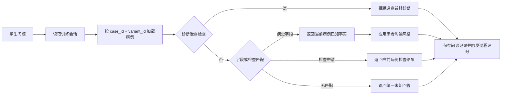

### 病例随机化与评分

每个病例提供 A/B/C 三个变体。变体可改变年龄、表达方式、病史呈现顺序和干扰信息，但 `hidden_final_diagnosis`、核心鉴别和安全逻辑保持不变。ScoringAgent 使用当前病例的 `key_scoring_points`、`high_risk_misses`、问诊记录、已申请检查、初步诊断、鉴别诊断、处理原则和引用证据进行独立评分，不使用固定胸痛量表。

### 病例证据隔离

训练提示和报告引用都通过 `CaseCitationService` 按 `case_id` 校验。RAG 检索结果只有在标题匹配当前病例 `recommended_guidelines` 白名单时才会返回；知识库未收录对应原文时，系统返回该病例自己的“Mock，待教师审核”引用占位，不允许使用胸痛或其他病例的指南兜底。可运行 `python scripts/verify_case_citations.py` 检查全部病例的引用隔离。

### 病例生成器

病例生成器当前为 Mock 骨架，包含：

- `case_source_adapter.py`：把已审核的公开摘要或题目元数据转换为候选字段。
- `case_generation_service.py`：补齐合成病例草稿并标记“待教师审核”。
- `case_validation_service.py`：检查最终诊断、鉴别诊断数量、评分点、风险遗漏、来源和虚拟病例声明。

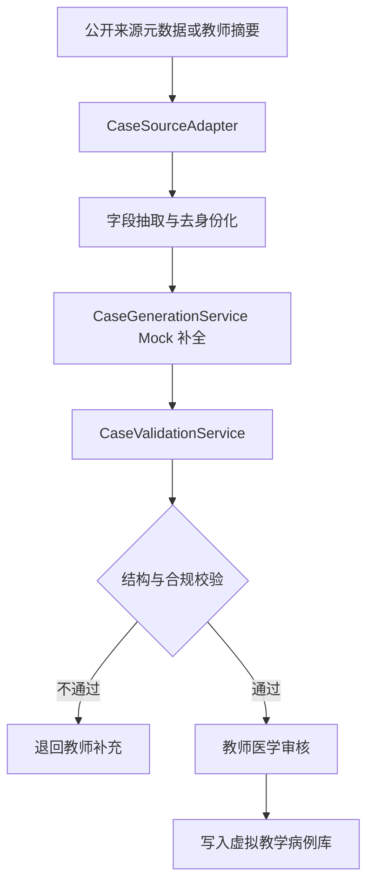

### 病例库与知识图谱联动

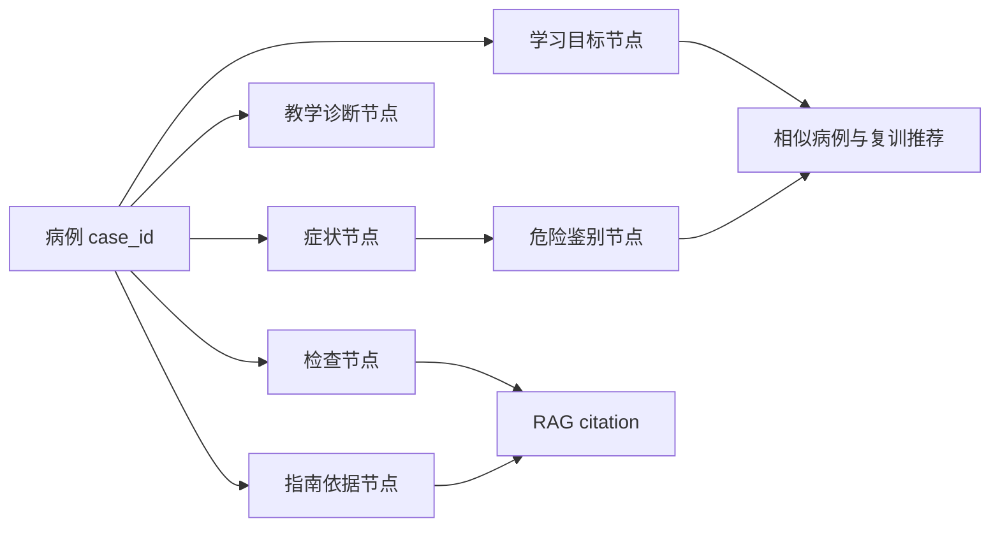

### 学生动态训练闭环

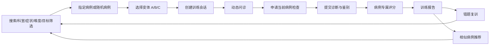

## 数据来源与合规说明

本项目所有病例均为团队自行编写的**合成虚拟教学病例**，不包含真实患者姓名、联系方式、住址、证件、就诊号、照片或其他身份信息；平台仅用于医学教育训练和教师复核，不用于真实临床诊断或治疗决策。

公开来源只用于数据字段设计、知识摘要和教学 Mock 规划，当前 41 例没有复制公开病例报告或版权教材原文，也没有下载大规模数据集。候选方向包括 ModelScope 医学数据集目录、PubMed Central 开放病例报告、MedMCQA、PubMedQA 和明确标记为 synthetic 的医学数据。正式接入任何数据前必须逐项检查许可证、伦理审批、隐私、脱敏、用途限制和可再分发范围，并保留教师审核与来源追踪。

## 新增病例与训练 API

- `GET /api/cases/search`：按关键词、科室、症状、难度和训练目标检索。
- `GET /api/cases/{case_id}/variants`：查看 A/B/C 变体。
- `POST /api/cases/random`：按筛选条件随机抽取病例和变体。
- `POST /api/training/start`：创建带 `session_id` 的训练会话。
- `POST /api/training/chat`：按当前病例和变体动态回答。
- `POST /api/training/order-test`：申请并解锁当前病例检查。
- `POST /api/training/submit-diagnosis`：提交诊断、鉴别和处理原则。
- `POST /api/training/score`：执行病例专属评分。
- `GET /api/training/recommendations`：返回今日、复训和相似病例。
- `POST /api/admin/cases/generate-mock`：生成待审核病例草稿。
- `POST /api/admin/cases/validate`：校验单例或完整病例库。
- `GET /api/admin/cases/source-plan`：查看公开来源接入与合规计划。

