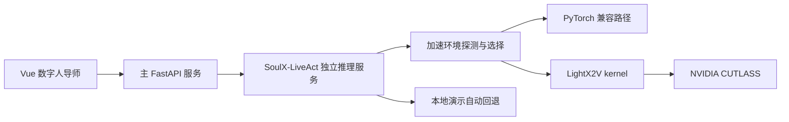

# 数字人 GPU 推理加速部署

本项目将 NVIDIA CUTLASS 与 LightX2V kernel 定位为数字人推理服务的可选算子加速层。它们不负责生成数字人形象、语音或动作；数字人的生成能力仍由 SoulX-LiveAct、模型权重、语音服务和业务适配器提供。

## 分层结构



## 当前电脑检测结果

- 显卡：NVIDIA GeForce RTX 4060 Laptop GPU，计算能力 8.9，显存约 8 GB。
- 当前 Python 环境未安装 PyTorch 和 LightX2V kernel。
- 当前系统未检测到 `nvcc`。
- NVFP4 面向更新的 NVIDIA 架构，RTX 4060 不启用该路径。
- CUTLASS 官方说明当前 CUTLASS 4.x/3.x 在 Windows 上的构建不可用，因此真实加速服务建议部署在 Ubuntu 或 WSL2。

以上限制不会影响网站和数字人的本地演示模式。

## 推荐部署环境

- Ubuntu 22.04/24.04 或可访问 NVIDIA GPU 的 WSL2
- NVIDIA 驱动与匹配的 CUDA Toolkit
- Python 3.10 或项目所用模型明确支持的版本
- PyTorch 2.7 或更高版本
- 单独的数字人推理虚拟环境，不与主 FastAPI 后端混装

## LightX2V kernel 构建

以下流程来自官方 README，路径需要替换为实际目录：

```bash
python -m pip install "torch>=2.7" scikit-build-core uv
git clone https://github.com/NVIDIA/cutlass.git
git clone https://github.com/ModelTC/LightX2V.git

cd LightX2V/lightx2v_kernel
uv build --wheel -Cbuild-dir=build . \
  -Ccmake.define.CUTLASS_PATH=/opt/cutlass \
  --no-build-isolation

python -m pip install dist/*.whl --force-reinstall --no-deps
```

构建后先运行 LightX2V kernel 自带测试，再启动数字人推理服务。不要跳过矩阵乘、量化带宽和吞吐测试。

## 环境变量

```env
LIVEACT_KERNEL_BACKEND=auto
CUTLASS_PATH=/opt/cutlass
LIGHTX2V_PATH=/opt/LightX2V
LIGHTX2V_KERNEL_WHEEL=/opt/LightX2V/lightx2v_kernel/dist/lightx2v_kernel.whl
LIGHTX2V_KERNEL_MODULE=lightx2v_kernel
LIGHTX2V_MIN_TORCH_VERSION=2.7
LIVEACT_ENABLE_NVFP4=false
LIVEACT_CUDA_ARCH=
```

`LIVEACT_KERNEL_BACKEND` 支持：

| 值 | 行为 |
| --- | --- |
| `auto` | 环境完整时选择 LightX2V kernel，否则使用 PyTorch 兼容路径 |
| `lightx2v` | 请求 LightX2V kernel；不满足条件时仍会安全回退 |
| `torch` | 始终使用兼容路径 |

## 健康检查

- 独立推理服务：`GET http://127.0.0.1:8090/kernel-health`
- 主后端代理接口：`GET http://127.0.0.1:8000/api/digital-human/acceleration`

接口会返回显卡、计算能力、PyTorch、CUDA、CUTLASS、LightX2V kernel、NVFP4 和最终选用后端，不包含密钥。

## 官方资料

- [NVIDIA CUTLASS](https://github.com/NVIDIA/cutlass/)
- [LightX2V kernel README](https://github.com/ModelTC/LightX2V/blob/main/lightx2v_kernel/README.md)
