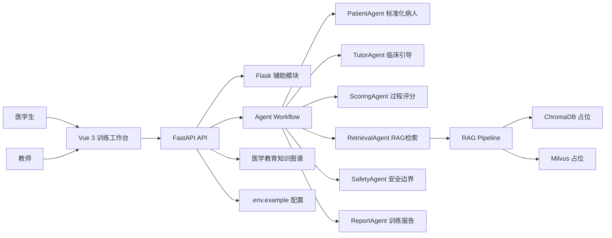
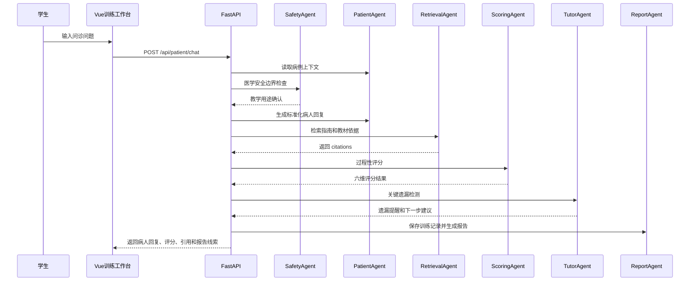
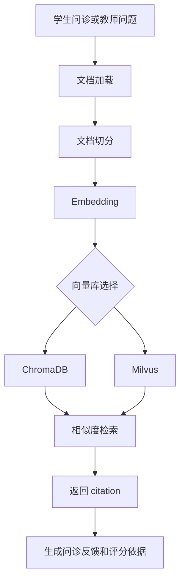
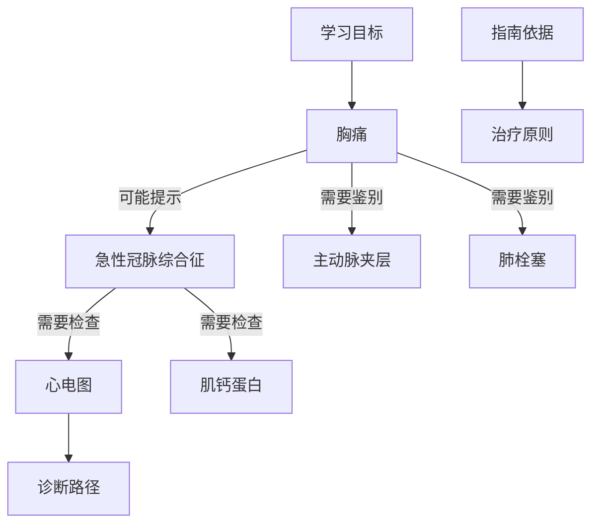

# 面向医学教育的 AI 标准化病人临床思维训练平台

本项目是一个用于医学教育和临床思维训练的 AI 教学平台原型，不用于真实临床诊断。平台通过 AI 标准化病人、临床思维评分、可追溯指南知识库、教师看板、Agent 工作流和 RAG 知识检索，帮助医学生训练问诊、鉴别诊断、检查选择、治疗原则和循证依据查找能力。

默认病例为“急诊胸痛”。所有病例均为虚拟教学病例，不包含真实患者信息。

## 技术栈

- 前端：Vue 3、TypeScript、Vite、HTML、CSS、JavaScript
- 后端：Python、FastAPI、Flask、Pydantic
- AI 骨架：LangChain、Agent Workflow、RAG
- 向量库预留：Milvus、ChromaDB
- 知识图谱预留：Neo4j，当前使用 mock JSON 图谱
- 配置：`.env.example` 占位，不包含真实密钥

## 前端架构

前端位于 `frontend/`：

- `src/App.vue`：完整交互原型，包含学生端、教师端、病例训练、指南知识库、教师看板、训练报告、知识图谱。
- `src/api.ts`：API 封装，后续可接真实后端。
- `src/types.ts`：前端类型定义。
- `src/styles.css`：响应式样式，浅色背景、蓝绿色主色、橙色风险提醒。
- `public/contest-rules.pdf`：赛题依据文件，非核心页面内容。

前端默认可脱离后端运行 mock 交互。设置 `VITE_API_BASE_URL` 后会调用真实 FastAPI 接口。

## 后端架构

后端位于 `backend/app/`：

- `main.py`：FastAPI 主服务，提供病例、问诊、评分、指南、教师看板、报告、图谱、RAG 接口。
- `flask_app.py`：Flask 辅助服务，挂载到 `/flask`。
- `models.py`：Pydantic 数据模型。
- `rag.py`：RAG 模块骨架，包含文档加载、切分、embedding 占位、Milvus/Chroma mock adapter、检索和 citation 返回。
- `workflow.py`：Agent 工作流骨架。
- `config.py`：环境变量读取。

## 系统总体架构图



## Agent + Workflow 流程图



## RAG 流程说明

当前 RAG 使用 mock adapter，代码结构保留真实接入点：

1. 文档加载：读取 `data/guidelines.json`。
2. 文档切分：按文本长度生成 chunk。
3. Embedding：当前为占位向量函数。
4. 向量库写入：支持 `MockChromaAdapter` 和 `MockMilvusAdapter`。
5. 检索：根据胸痛、ACS、心电图、肌钙蛋白等关键词召回。
6. citation 返回：每条反馈返回 `id/title/source/snippet`。
7. 后续可替换为真实 LangChain Retriever、Milvus、ChromaDB 和模型 API。

## RAG 检索流程图



## 知识图谱设计说明

知识图谱数据位于 `data/medical_kg.json`，包含：疾病、症状、体征、检查、诊断、鉴别诊断、治疗原则、指南依据、学习目标。

示例关系：

- 胸痛 -> 可能提示 -> 急性冠脉综合征
- 急性冠脉综合征 -> 需要检查 -> 心电图
- 急性冠脉综合征 -> 需要检查 -> 肌钙蛋白
- 胸痛 -> 需要鉴别 -> 主动脉夹层
- 胸痛 -> 需要鉴别 -> 肺栓塞

## 医学知识图谱示意图



## 项目目录结构

```text
ai+medicine/
  .env.example
  environment.yml
  README.md
  frontend/
    src/
      App.vue
      api.ts
      types.ts
      styles.css
    public/
      contest-rules.pdf
  backend/
    app/
      main.py
      models.py
      rag.py
      workflow.py
      flask_app.py
      config.py
  data/
    cases.json
    guidelines.json
    teacher_dashboard.json
    medical_kg.json
  env/
    .env.example
```

## `.env.example` 配置说明

根目录 `.env.example` 包含：

- LLM API：OpenAI 或兼容模型接口
- TTS API：语音标准化病人预留
- Embedding：向量化模型预留
- Milvus：向量库连接配置
- ChromaDB：本地向量库路径和集合名
- Neo4j：医学知识图谱配置
- Backend：FastAPI 主机、端口和环境
- Frontend：`VITE_API_BASE_URL`

不要在仓库中写入真实密钥。

## 本地启动步骤

### 后端

```powershell
cd D:\cc项目\ai+medicine
conda env create -f environment.yml
conda activate clinical-sp-ai
python -m backend.app.main
```

后端默认地址：`http://127.0.0.1:8000`

### 前端

```powershell
cd D:\cc项目\ai+medicine\frontend
pnpm install
pnpm dev
```

前端默认地址：`http://127.0.0.1:5173`

如果要让前端调用后端，在 `.env` 或运行环境中设置：

```env
VITE_API_BASE_URL=http://127.0.0.1:8000
```

## 示例 API

- `GET /api/health`
- `GET /api/site/overview`
- `GET /api/cases`
- `POST /api/patient/chat`
- `GET /api/guidelines`
- `GET /api/teacher/dashboard`
- `GET /api/training/report`
- `GET /api/knowledge-graph`
- `GET /api/workflow`
- `POST /api/rag/query`
- `POST /api/rag/index`
- `GET /flask/status`

## 后续可扩展方向

- 接入真实 LLM API，让 PatientAgent 依据病例脚本生成更自然但受控的回复。
- 接入 TTS，让 AI 标准化病人支持语音问诊。
- 使用 LangChain Retriever 替换 mock RAG。
- 接入 Milvus 或 ChromaDB 实现真实向量检索。
- 接入 Neo4j 管理医学教育知识图谱。
- 增加教师批改、班级管理、学生历史训练记录和多病例 OSCE 流程。
- 增加病例脚本编辑器，让教师维护虚拟病例。
- 增加安全审计日志，记录模型输出、citation 和人工复核状态。
