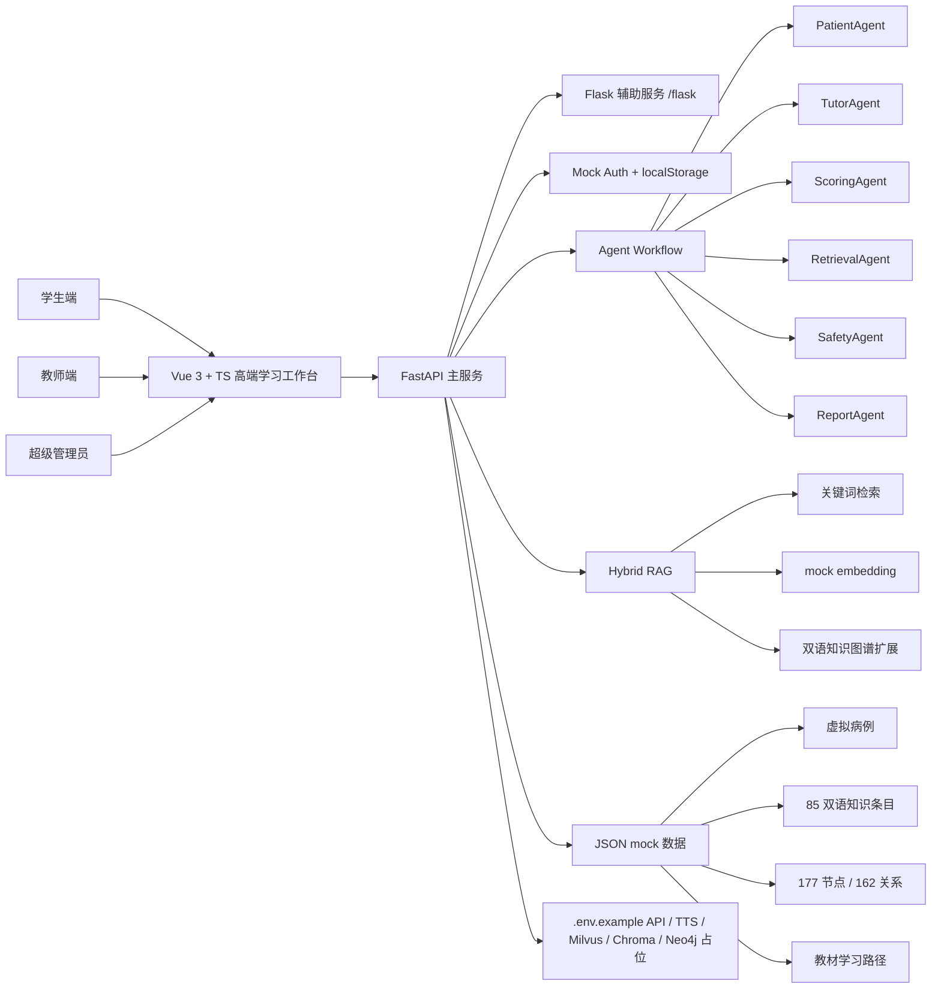
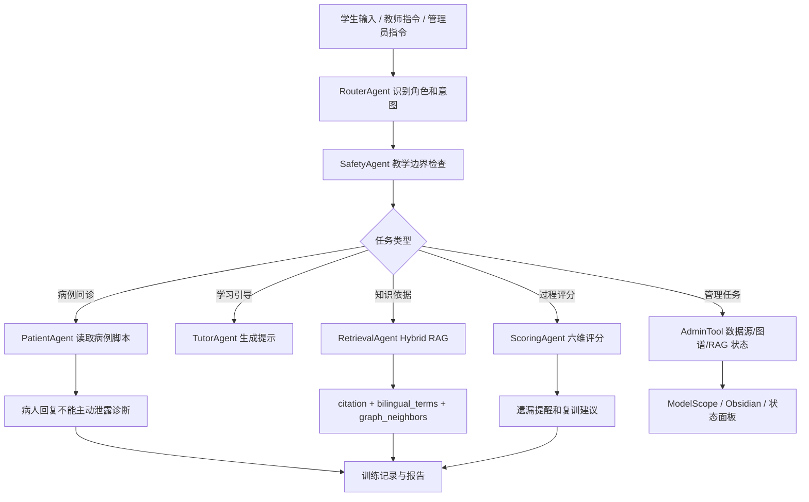
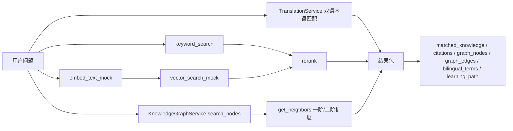
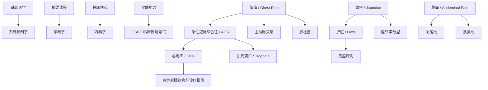
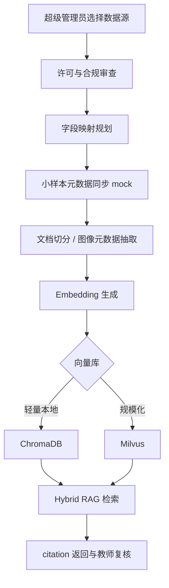
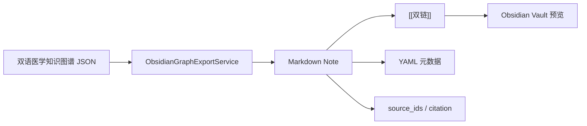

# 临思智训：AI 标准化病人临床思维训练平台

本项目是面向医学教育的 AI 标准化病人临床思维训练平台原型，不用于真实临床诊断。平台通过 AI 标准化病人、临床思维评分、教材学习路径、可追溯指南知识库、教师看板、超级管理员控制台、Agent Workflow、Hybrid RAG、双语医学知识图谱和解剖定位训练，帮助医学生训练问诊、鉴别诊断、检查选择、治疗原则和循证依据查找能力。

第五版重点把你提供的医学教材体系并入平台：基础医学 -> 桥梁课程 -> 临床核心 -> 专科拓展 -> 实践能力，同时加入英文经典参考书、ModelScope 数据源规划、管理员账号体系、双语图谱和 Obsidian 风格导出。所有病例均为虚拟教学病例，不包含真实患者信息，不写入真实 API 密钥。

## 演示登录

- 学生端：`student / student123`
- 教师端：`teacher / teacher123`
- 超级管理员：`admin / admin123`

前端使用 localStorage 保存演示登录状态；后端提供 mock auth 接口：

- `POST /api/auth/login`
- `GET /api/auth/me`
- `POST /api/auth/logout`

## 技术栈

- 前端：Vue 3、TypeScript、Vite、HTML、CSS、JavaScript
- 后端：Python、FastAPI、Flask、Pydantic
- AI 骨架：PatientAgent、TutorAgent、ScoringAgent、RetrievalAgent、SafetyAgent、ReportAgent
- RAG：HybridRetrievalService、mock embedding、citation 返回、Milvus/ChromaDB 占位
- 知识图谱：双语 JSON mock，Neo4j 占位，Obsidian Markdown 导出预览
- 配置：`.env.example` 占位，不包含真实密钥

## 第五版新增内容

- 新增登录页和三类角色：学生、教师、超级管理员。
- 新增超级管理员工作台：用户管理、ModelScope 数据源、知识库状态、图谱状态、RAG 配置、Obsidian 导出。
- ModelScope 数据源规划包含 `AI-ModelScope/med_qa`、`GoodBaiBai88/M3D-VQA`、`GoodBaiBai88/M3D-Cap`、`GoodBaiBai88/M3D-Seg`。
- 知识库扩展为 85 条双语 mock 知识，保留 title_zh/title_en、summary_zh/summary_en、citation、embedding_text、graph_node_ids。
- 双语医学教育知识图谱扩展为 177 个节点、162 条关系，节点包含疾病、症状、体征、检查、诊断、鉴别诊断、治疗原则、指南依据、学习目标和教材节点。
- 知识图谱支持中文/英文切换、ACS/chest pain 等英文术语检索、节点详情、邻居关系和学习路径。
- RAG 返回 `matched_knowledge`、`graph_nodes`、`graph_edges`、`bilingual_terms`、相关病例、相关解剖练习和推荐学习路径。
- 教材学习路径纳入基础医学、桥梁课程、临床核心、专科拓展、实践能力、英文经典参考。

## 项目目录结构

```text
ai+medicine/
  frontend/
    src/
      App.vue                  三角色产品工作台
      api.ts                   前端 API 封装
      types.ts                 前端类型定义
      styles.css               响应式 UI、登录页、管理员台、数字人、解剖图、图谱样式
      data/
        admin.ts               管理员用户和数据源 mock
        cases.ts               8 个虚拟教学病例
        knowledge.ts           85 条双语知识条目
        graph.ts               177 节点 / 162 关系双语图谱
        textbooks.ts           教材学习路径
        anatomy.ts             解剖定位练习
  backend/
    app/
      main.py                  FastAPI 路由、Auth、Agent、训练、RAG、图谱、管理端
      models.py                Pydantic 模型
      data_sources.py          管理端数据源加载
      translation_service.py   双语术语服务
      obsidian_export_service.py Obsidian Markdown 预览导出
      embedding_service.py     mock embedding 服务
      hybrid_retrieval_service.py
      knowledge_graph_service.py
      flask_app.py             Flask 辅助模块
  data/
    admin_users.json
    data_sources.json
    textbook_pathways.json
    knowledge.json
    medical_kg_bilingual.json
    cases.json
    anatomy.json
    guidelines.json
  .env.example
```

## 系统总体架构图



## Agent + Workflow 流程图



## RAG 检索流程图



后续接入真实服务时：`EmbeddingService` 替换为真实 embedding API，mock vector 替换为 ChromaDB 或 Milvus，`KnowledgeGraphService` 替换为 Neo4j 查询，`RetrievalAgent` 可接 LangChain Runnable 或 LangGraph。

## 医学知识图谱示意图



## ModelScope 数据源接入流程图



## Obsidian 图谱导出流程图



## 主要后端接口

- `POST /api/auth/login`
- `GET /api/auth/me`
- `POST /api/auth/logout`
- `GET /api/cases`
- `POST /api/training/chat`
- `GET /api/training/report`
- `GET /api/knowledge/search?q=ACS&lang=en`
- `GET /api/graph?lang=zh`
- `GET /api/graph/search?query=ACS&lang=en`
- `POST /api/rag/query`
- `POST /api/rag/hybrid-query`
- `GET /api/textbook-pathways`
- `GET /api/admin/users`
- `GET /api/admin/data-sources`
- `POST /api/admin/data-sources/sync`
- `GET /api/admin/knowledge-status`
- `GET /api/admin/graph-status`
- `POST /api/admin/obsidian/export`

## `.env.example` 配置说明

根目录 `.env.example` 保留 LLM API、TTS API、Embedding、Milvus、ChromaDB、Neo4j、Backend、Frontend 配置占位。不要写真实密钥。后端默认没有真实配置时使用 mock 能力。

## 本地启动步骤

后端：

```powershell
cd D:\cc项目\ai+medicine
.\scripts\start-backend.ps1 -Python .\.venv\Scripts\python.exe
```

接口文档：`http://127.0.0.1:8000/docs`

前端：

```powershell
cd D:\cc项目\ai+medicine\frontend
pnpm dev
```

前端访问：`http://127.0.0.1:5173`

## 后续可扩展方向

- 接入真实 LLM、TTS 和数字人视频流。
- 把教材目录、指南摘要、病例脚本走教师审核后进入 RAG。
- 将 ChromaDB 用作本地演示，将 Milvus 用作竞赛展示规模化检索。
- Neo4j 接管双语知识图谱查询和推荐路径生成。
- 为教师端增加班级、课程、OSCE 站点和批改工作流。
- 为管理员端增加数据源权限、许可审查、脱敏审计和同步任务队列。
